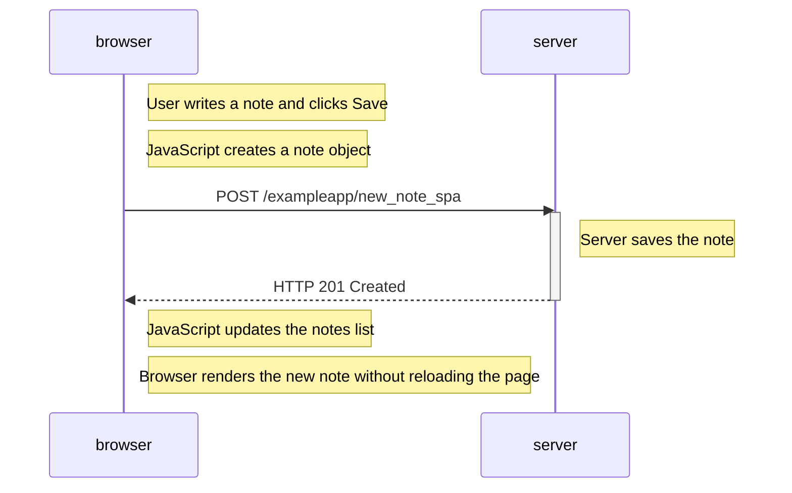

```mermaid
    sequenceDiagram
    participant browser
    participant server

    Note right of browser: User writes a note and clicks Save

    Note right of browser: JavaScript creates a note object

    browser->>server: POST /exampleapp/new_note_spa
    activate server
    Note right of server: Server saves the note
    server-->>browser: HTTP 201 Created
    deactivate server

    Note right of browser: JavaScript updates the notes list
    Note right of browser: Browser renders the new note without reloading the page
```
